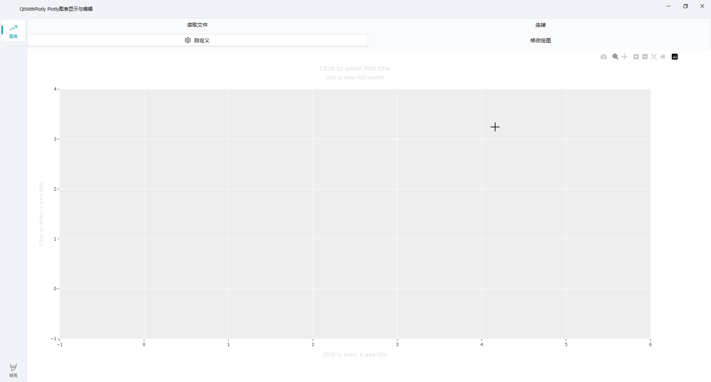

# QtWithPlotly

QtWithPlotly 是一个结合了 PyQt5 和 Dash 的应用，用于实现数据的可视化，并允许用户对生成的图表进行二次编辑。

# 功能演示

以下是QtWithPlotly的一些功能演示截图：

## 安装

### Windows 7 及以上系统

确保你的系统满足以下条件：

- 操作系统：Windows 7 或更高版本
- Python 版本：推荐使用 Python 3.6 以上版本

#### 安装步骤：

1. 安装 Python：
   - 访问 https://www.python.org/downloads/windows/ 下载最新版 Python，并按照指示完成安装。
   - 在安装过程中，请勾选 "Add Python to PATH" 选项以自动配置环境变量。

2. 安装依赖库：
   - 打开命令提示符（CMD）或 PowerShell。
   - 运行 `pip install -r requirements.txt` 命令来安装所有必要的库。确保你已经创建了一个名为 `requirements.txt` 的文件，其中列出了所有的依赖项。

3. 运行应用程序：
   - 导航至包含 `main.py` 文件的目录。
   - 在命令提示符中输入 `python main.py` 并按 Enter 键启动程序。

## 使用方法

下载本仓库到本地后，只需运行 `python main.py` 即可启动应用程序。

## 许可证

本项目采用 MIT 许可证发布。详情参见 [LICENSE](LICENSE) 文件。

## 致谢

感谢所有为此项目做出贡献的人们！

## 联系方式

如有任何问题或建议，请通过以下方式联系我们：

- 邮箱：[你的邮箱地址]
- GitHub Issues：[项目Issues页面链接]
